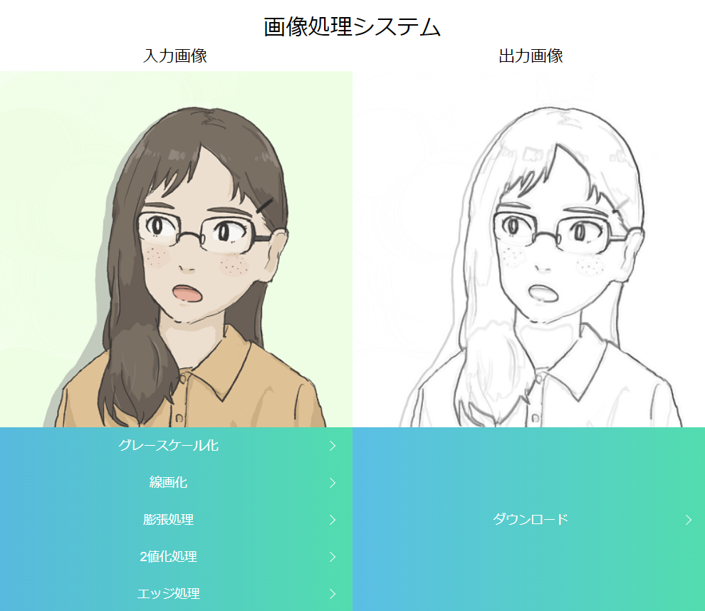

# 勉強会用資料 公開リポジトリ
HTML，CSS，JavaScriptを学ぶ勉強会のために作成されたプログラム

### 事前準備
1. opencv.jsサイトにアクセス (https://docs.opencv.org/3.4.0/opencv.js)
2. 右クリック->名前を付けて保存
3. ダウンロードしたopencv.jsを「JS_studyフォルダ直下」に設置
 

---
**第1回：opencv.jsを用いた簡単な画像処理システム**
 
opencv.jsを用いて入力画像に対して画像処理を加える簡単なシステム作成

<機能>
 
1. ドラッグ&ドロップもしくはファイル選択で画像入力
2. グレースケール化，線画化，膨張処理をボタン操作
3. 単一ファイルのダウンロード
 

勉強会資料：https://note.com/text_2021/n/n398e222aaa9d

<参考サイト>
 
[Image Convert With OpenCV.js](https://gist.github.com/mignonstyle/083c9e1651d7734f84c99b8cf49d57fa)
 
[HTML5/JavaScript でファイルのドラッグ＆ドロップ、画像ファイルのプレビュー](https://r17n.page/2020/10/24/html-js-drag-and-drop-file/)
 
[CSSのみのボタンデザイン](https://pulpxstyle.com/css-button/)
 

---
**第2回(予定)：Chart.jsを用いたグラフアニメ表現**
 
「HSV抽出」ボタンを追加。
入力画像のHSV値を取得し，棒グラフで表現。
棒グラフはアニメーション表現を行う